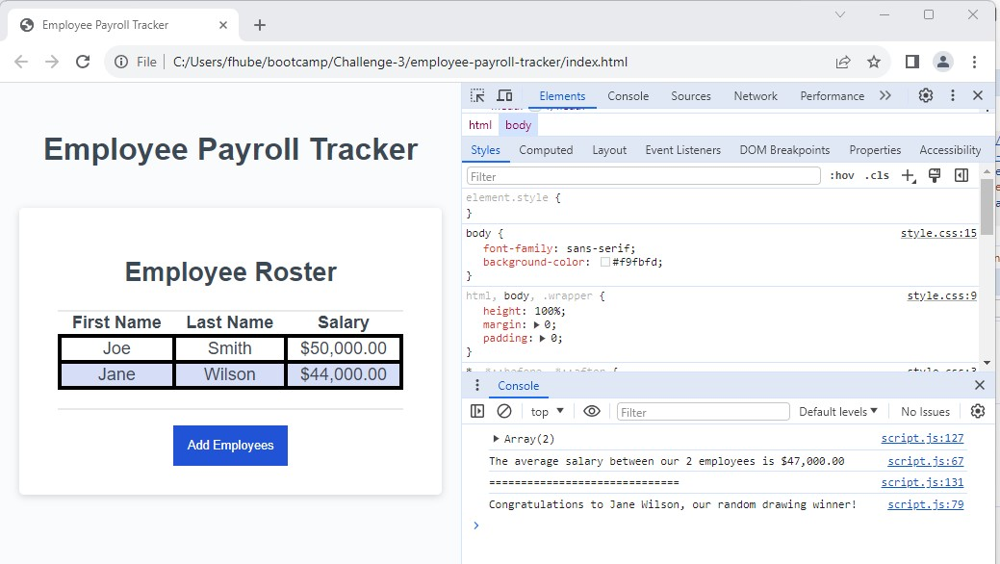

# Employee Payroll Tracker

## Task

This week's Challenge I will create an application that enables a payroll manager to view and manage employee payroll data. The app will run in the browser and will feature dynamically updated HTML and CSS powered by JavaScript code. 

## User Story 

AS A payroll manager

I WANT AN employee payroll tracker
SO THAT I can see my employees' payroll data and properly budget for the company

## Acceptance Criteria

GIVEN an employee payroll tracker
WHEN I click the "Add employee" button

THEN I am presented with a series of prompts asking for first name, last name, and salary
WHEN I finish adding an employee

THEN I am prompted to continue or cancel
WHEN I choose to continue

THEN I am prompted to add a new employee
WHEN I choose to cancel
THEN my employee data is displayed on the page sorted alphabetically by last name, and the console shows computed and aggregated data

## Deployment

## Mock-up

The following image shows the web application's appearance and functionality:

